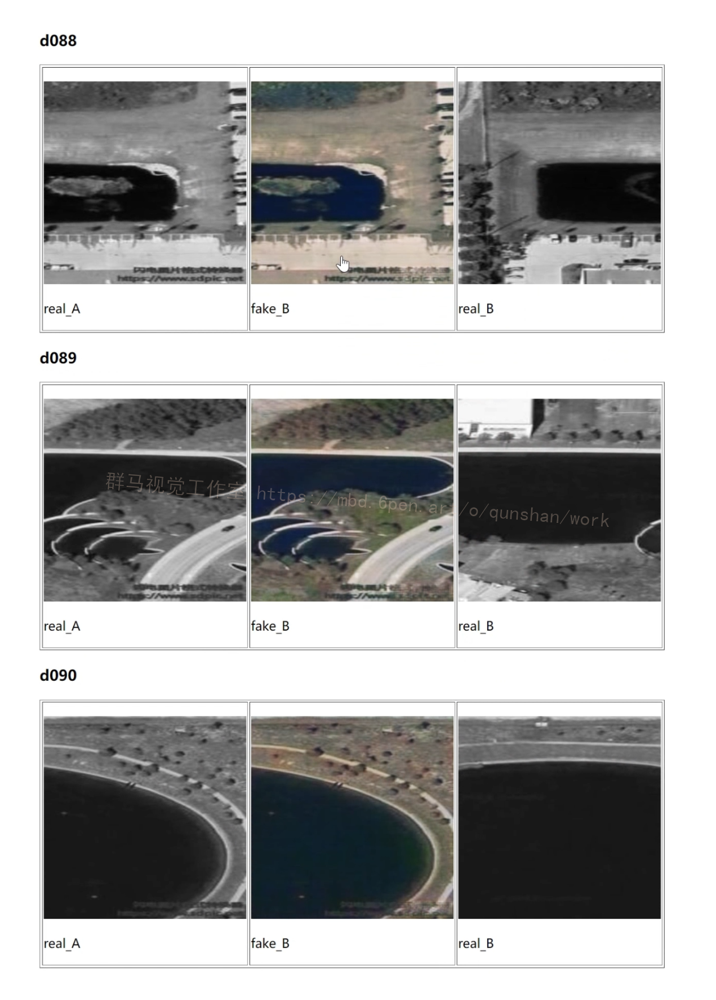
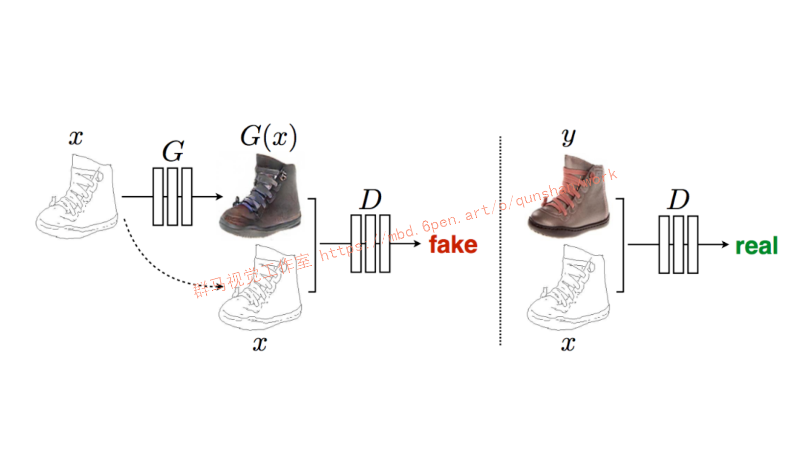
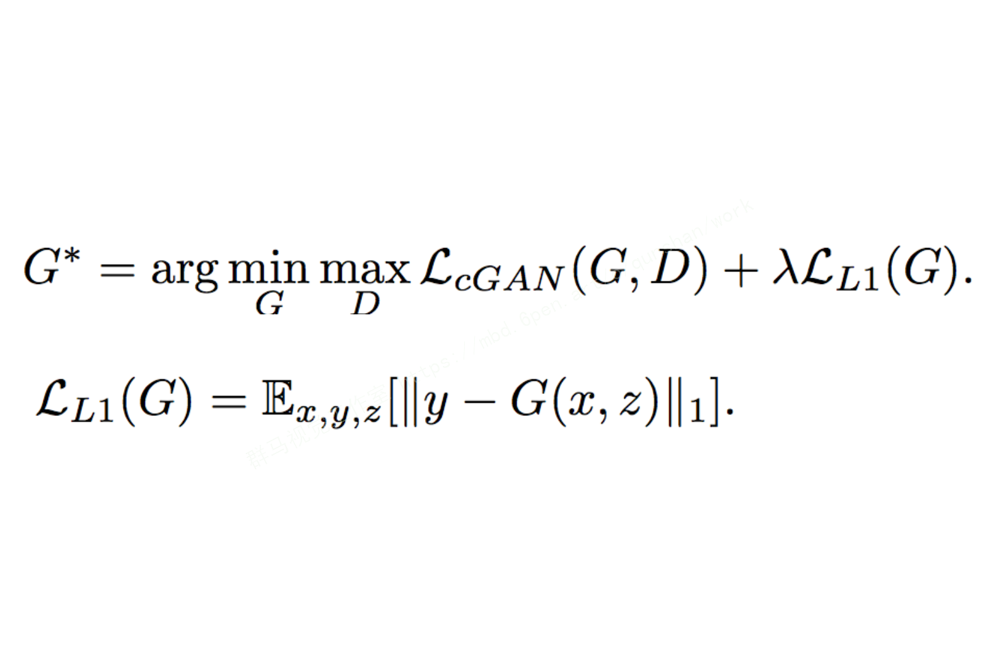
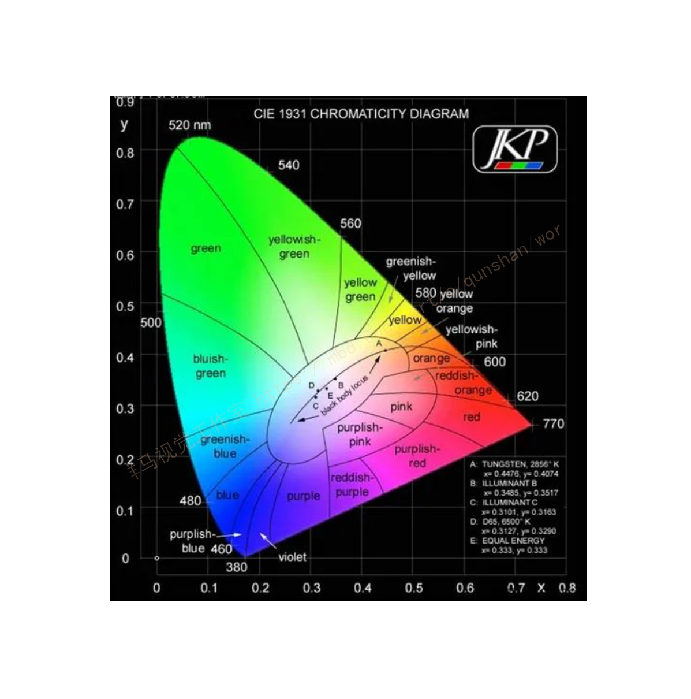
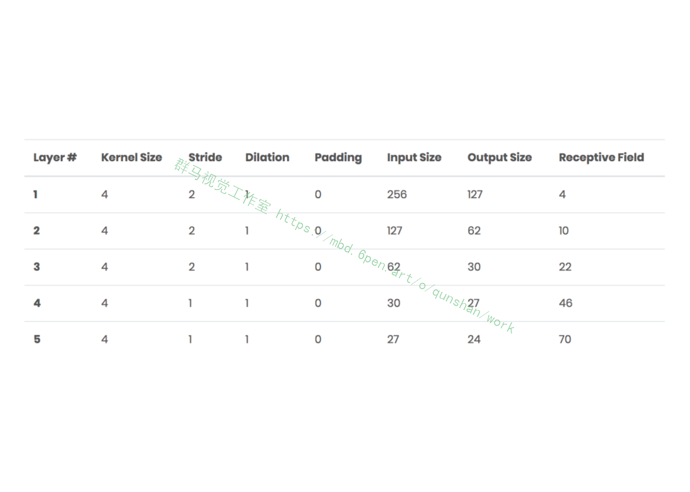
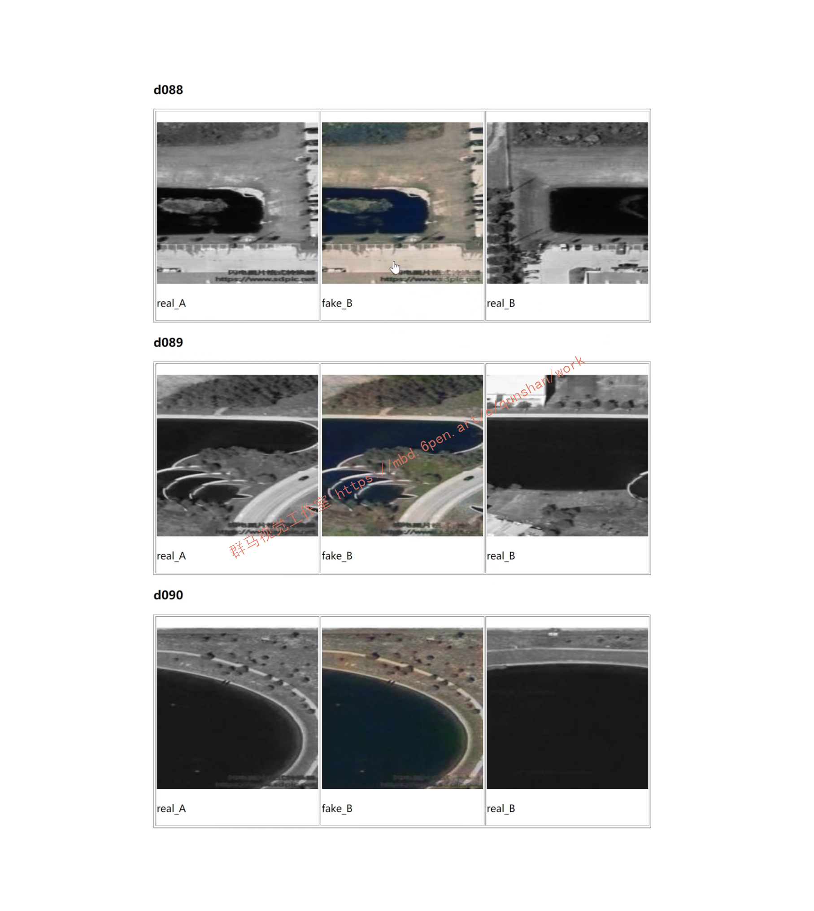
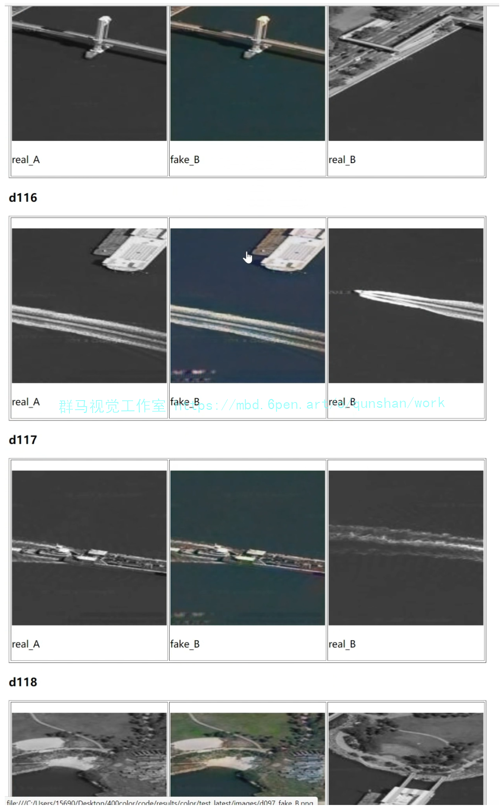
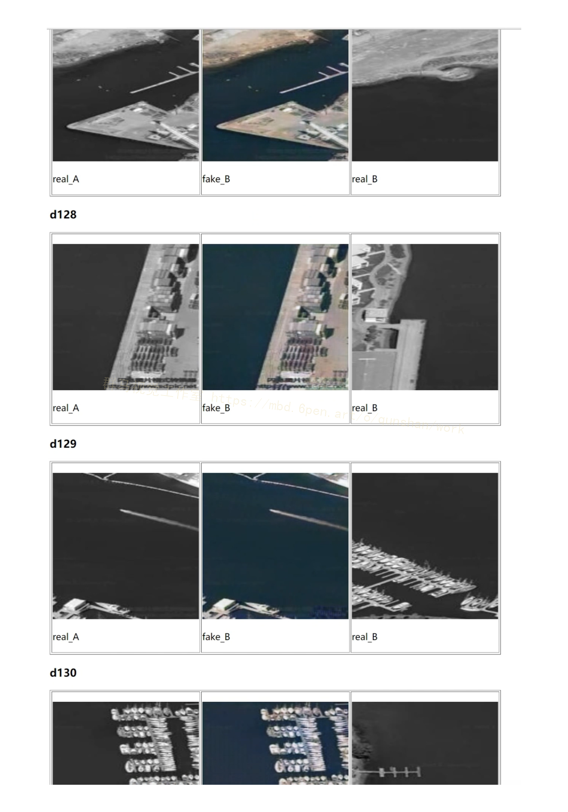

# 1.项目背景
自从GAN技术发展以来，许多新奇的应用都得到了落地，本次我们来介绍其中一个小应用，就是黑白图像上色。想必大家在网上经常看到一些给黑白图像上色的视频，可以修复早期的黑白影像，背后的技术就是GAN，下面的动图就是我们本次项目实战的案例图，对人像、照片、建筑图进行上色。


# 2.原理简介
本次我们来实现基于Pix2Pix的黑白图片上色，Pix2Pix是一个通用的框架，可以适用于任何的图像翻译类任务，下面我们首先来介绍其原理。

它的生成器和判别器的输入都不是噪声，而是真实的图片。输入图x经过生成器G之后得到生成图片G(x)，然后一边将G(x)和x一起作为判别器的输入，另一边将真实标注y和x一起作为判别器的输入，前者判别器输出为fake，后者为real。
G就是一个常见的编解码结构，D就是一个普通分类器，那这样的生成式框架有什么优势呢？
作者们认为，一般的编解码结构可以解决低频成分的生成，但是高频的细节不够理想，而GAN则擅长解决高频成分的生成。总的生成器损失函数为一个标准的条件GAN损失加上L1重建损失，分别定义如下：


具体实现我们看接下来的代码。

# 3.数据预处理

对于图像上色任务来说，在CIELab颜色空间比在RGB颜色空间会有更好的效果，因为CIELab颜色空间中的L通道只有灰度信息，而a和b通道只有颜色信息，实现了亮度与颜色的分离。

下图展示了CIELab颜色中的颜色分布，相比于其他彩色空间，有更加线性和均匀的分布特性。


因此，在数据读取模块中，需要将RGB图像转换到CIELab颜色空间，然后构建成对的数据。下面我们来查看数据读取类中的核心功能函数，包括初始化函数__init__与数据迭代器__getitem__。

## 数据类定义如下
```
class ColorizationDataset(BaseDataset):

   def __init__(self, opt):

        BaseDataset.__init__(self, opt)

        self.dir = os.path.join(opt.dataroot, opt.phase)

        self.AB_paths = sorted(make_dataset(self.dir, opt.max_dataset_size))

        assert(opt.input_nc == 1 and opt.output_nc == 2 and opt.direction == 'AtoB')

        self.transform = get_transform(self.opt, convert=False)

    def __getitem__(self, index):

        path = self.AB_paths[index]

        im = Image.open(path).convert('RGB') ## 读取RGB图

        im = self.transform(im) ## 进行预处理

        im = np.array(im)

        lab = color.rgb2lab(im).astype(np.float32) ## 将RGB图转换为CIELab图

        lab_t = transforms.ToTensor()(lab)

        L = lab_t[[0], ...] / 50.0 - 1.0 ## 将L通道(index=0)数值归一化到-1到1之间

        AB = lab_t[[1, 2], ...] / 110.0 ## 将A，B通道(index=1,2)数值归一化到0到1之间

        return {'A': L, 'B': AB, 'A_paths': path, 'B_paths': path}

```
在上面的__getitem__函数中，首先使用了PIL包读取图片，然后将其预处理后转换到CIELab空间中。读取后的L通道的数值范围是在0～100之间，通过处理后归一化到-1和1之间。读取后的A和B的通道的数值范围是在0～110之间，通过处理后归一化到0和1之间。

另外在__init__函数中进行了预处理，调用了get_transform函数，它主要包含了图像缩放，随机裁剪，随机翻转，减均值除以方差等操作，由于是比较通用的操作，这里不再对关键代码进行解读。

# 4.生成器网络
生成器使用的是U-Net结构，在该开源框架中也还可以选择残差结构，不过我们使用U-Net完成实验任务

## UNet生成器定义如下
```
class UnetGenerator(nn.Module):

    def __init__(self, input_nc, output_nc, num_downs, ngf=64, norm_layer=nn.BatchNorm2d, use_dropout=False):

 super(UnetGenerator, self).__init__()

        unet_block = UnetSkipConnectionBlock(ngf*8,ngf*8, input_nc=None, submodule=None, norm_layer=norm_layer, innermost=True)  # add the innermost layer

        for i in range(num_downs - 5):        

            unet_block=UnetSkipConnectionBlock(ngf*8,ngf*8,input_nc=None, submodule=unet_block, norm_layer=norm_layer, use_dropout=use_dropout)

            ## 逐步减小通道数，从ngf * 8到ngf

            unet_block=UnetSkipConnectionBlock(ngf*4,ngf*8,input_nc=None, submodule=unet_block, norm_layer=norm_layer)

            unet_block=UnetSkipConnectionBlock(ngf*2,ngf*4,input_nc=None, submodule=unet_block, norm_layer=norm_layer)

            unet_block=UnetSkipConnectionBlock(ngf,ngf*2,input_nc=None, submodule=unet_block, norm_layer=norm_layer)

            self.model=UnetSkipConnectionBlock(output_nc,ngf,input_nc=input_nc, submodule=unet_block, outermost=True, norm_layer=norm_layer) ## 最外层

    def forward(self, input):

        """Standard forward"""

        return self.model(input)
```
其中重要参数解释如下：input_nc 是输入通道，output_nc是输出通道，num_downs 是降采样次数，为2^num_downs，ngf是最后一层通道数，norm_layer是归一化层。
```
UnetSkipConnectionBlock是跳层连接的模块，它的定义如下：

class UnetSkipConnectionBlock(nn.Module):

    def __init__(self, outer_nc, inner_nc, input_nc=None,

                 submodule=None,outermost=False,innermost=False, norm_layer=nn.BatchNorm2d, use_dropout=False):

        super(UnetSkipConnectionBlock, self).__init__()

        self.outermost = outermost

        if type(norm_layer) == functools.partial:

            use_bias = norm_layer.func == nn.InstanceNorm2d

        else:

            use_bias = norm_layer == nn.InstanceNorm2d

        if input_nc is None:

            input_nc = outer_nc

        downconv = nn.Conv2d(input_nc, inner_nc, kernel_size=4,

                             stride=2, padding=1, bias=use_bias)

        downrelu = nn.LeakyReLU(0.2, True)

        downnorm = norm_layer(inner_nc)

        uprelu = nn.ReLU(True)

        upnorm = norm_layer(outer_nc)

        if outermost:

            upconv = nn.ConvTranspose2d(inner_nc * 2, outer_nc,

                                        kernel_size=4, stride=2,

                                        padding=1)

            down = [downconv]

            up = [uprelu, upconv, nn.Tanh()]

            model = down + [submodule] + up

        elif innermost:

            upconv = nn.ConvTranspose2d(inner_nc, outer_nc,

                                        kernel_size=4, stride=2,

                                        padding=1, bias=use_bias)

            down = [downrelu, downconv]

            up = [uprelu, upconv, upnorm]

            model = down + up

        else:

            upconv = nn.ConvTranspose2d(inner_nc * 2, outer_nc,

                                        kernel_size=4, stride=2,

                                        padding=1, bias=use_bias)

            down = [downrelu, downconv, downnorm]

            up = [uprelu, upconv, upnorm]

            ##是否使用dropout

            if use_dropout:

                model = down + [submodule] + up + [nn.Dropout(0.5)]

            else:

                model = down + [submodule] + up

        self.model = nn.Sequential(*model)

    def forward(self, x):

        if self.outermost:#最外层直接输出

            return self.model(x)

        else:#添加跳层

            return torch.cat([x, self.model(x)], 1)
```
其中outer_nc是外层通道数，inner_nc是内层通道数，input_nc是输入通道数，submodule即前一个子模块，outermost判断是否是最外层，innermost判断是否是最内层，norm_layer即归一化层，user_dropout即是否使用dropout。

对于pix2pix模型，使用的归一化层默认为nn.BatchNorm2d，当batch=1时，它实际上与InstanceNorm等价。

# 5.判别器定义
[参考该博客判别器的定义](https://mbd.pub/o/bread/Y5Wakp1p)，判别器是一个分类模型，不过在前面我们说了，它的输入不是整张图片，而是图像块，因此判别器的输出不是单独的一个数，而是多个图像块的概率图，最终将其相加得到完整的概率，定义如下：

## PatchGAN的定义如下
```
class NLayerDiscriminator(nn.Module):

    def __init__(self, input_nc, ndf=64, n_layers=3, norm_layer=nn.BatchNorm2d):

        super(NLayerDiscriminator, self).__init__()

        if type(norm_layer) == functools.partial:  ##判断归一化层类别，如果是BN则不需要bias

            use_bias = norm_layer.func == nn.InstanceNorm2d

        else:

            use_bias = norm_layer == nn.InstanceNorm2d

        kw = 4 ##卷积核大小

        padw = 1 ##填充大小

        ## 第一个卷积层

        sequence = [nn.Conv2d(input_nc, ndf, kernel_size=kw, stride=2, padding=padw), nn.LeakyReLU(0.2, True)]

        nf_mult = 1

        nf_mult_prev = 1

        ## 中间2个卷积层

        for n in range(1, n_layers):  ##逐渐增加通道宽度，每次扩充为原来两倍

            nf_mult_prev = nf_mult

            nf_mult = min(2 ** n, 8)

            sequence += [

                nn.Conv2d(ndf * nf_mult_prev, ndf * nf_mult, kernel_size=kw, stride=2, padding=padw, bias=use_bias),

                norm_layer(ndf * nf_mult),

                nn.LeakyReLU(0.2, True)

            ]

        nf_mult_prev = nf_mult

        nf_mult = min(2 ** n_layers, 8)

        ## 第五个卷积层

        sequence += [

            nn.Conv2d(ndf * nf_mult_prev, ndf * nf_mult, kernel_size=kw, stride=1, padding=padw, bias=use_bias),

            norm_layer(ndf * nf_mult),

            nn.LeakyReLU(0.2, True)

        ]

        ## 输出单通道预测结果图

        sequence += [nn.Conv2d(ndf * nf_mult, 1, kernel_size=kw, stride=1, padding=padw)] 

        self.model = nn.Sequential(*sequence)

    def forward(self, input):

        return self.model(input)
```
其中input_nc是输入图通道，ndf是最后一个卷积层通道，n_layers是判别器层数，norm_layer是归一化层类型。从代码可以看出，默认包括了5层卷积，其中卷积核大小都为4*4，前面3层的stride=2，后两个卷积层的stride=1，总的感受野为70*70，这也是前面所说的实际上是取70*70的块的原因，各层输入输出以及感受野统计情况如下：



# 6.损失函数定义
接下来我们再看损失函数的定义。
```
class GANLoss(nn.Module):

    def __init__(self, gan_mode, target_real_label=1.0, target_fake_label=0.0):

        #gan_model，损失类型，支持原始损失，lsgan，wgangp

        super(GANLoss, self).__init__()

        self.register_buffer('real_label', torch.tensor(target_real_label))

        self.register_buffer('fake_label', torch.tensor(target_fake_label))

        self.gan_mode = gan_mode

        if gan_mode == 'lsgan':

            self.loss = nn.MSELoss()

        elif gan_mode == 'vanilla':

            self.loss = nn.BCEWithLogitsLoss()

        elif gan_mode in ['wgangp']:

            self.loss = None

        else:

            raise NotImplementedError('gan mode %s not implemented' % gan_mode)

    #将标签转为与预测结果图同样大小

    def get_target_tensor(self, prediction, target_is_real):

        if target_is_real:

            target_tensor = self.real_label

        else:

            target_tensor = self.fake_label

        return target_tensor.expand_as(prediction)

    ##返回损失

    def __call__(self, prediction, target_is_real):

        if self.gan_mode in ['lsgan', 'vanilla']:

            target_tensor = self.get_target_tensor(prediction, target_is_real)

            loss = self.loss(prediction, target_tensor)

        elif self.gan_mode == 'wgangp':

            if target_is_real:

                loss = -prediction.mean()

            else:

                loss = prediction.mean()

        return loss
```
以上代码实现了对几种常见的GAN对抗损失的计算。

# 7.完整结构定义
定义好判别器和生成器之后，参考[该博客完整的pix2pix模型的定义](https://afdian.net/item?plan_id=ae53de34623f11edabfc52540025c377)，如下：
class Pix2PixModel(BaseModel):

    ##配置默认参数

    def modify_commandline_options(parser, is_train=True):

        ##默认使用batchnorm，网络结构为unet_256，使用成对的(aligned)图片数据集

        parser.set_defaults(norm='batch', netG='unet_256', dataset_mode='aligned')

        if is_train:

            parser.set_defaults(pool_size=0, gan_mode='vanilla')#使用经典GAN损失

            parser.add_argument('--lambda_L1', type=float, default=100.0, help='weight for L1 loss')#L1损失权重为100

    def __init__(self, opt):

        BaseModel.__init__(self, opt)

        self.loss_names = ['G_GAN', 'G_L1', 'D_real', 'D_fake'] ##损失

        self.visual_names = ['real_A', 'fake_B', 'real_B'] ##中间结果图

        if self.isTrain:

            self.model_names = ['G', 'D']

        else:  # during test time, only load G

            self.model_names = ['G']

        #生成器和判别器定义

        self.netG = networks.define_G(opt.input_nc, opt.output_nc, opt.ngf, opt.netG, opt.norm,not opt.no_dropout, opt.init_type, opt.init_gain, self.gpu_ids)

        # 判别器定义，输入RGB图和生成器图的拼接

        if self.isTrain:

            self.netD = networks.define_D(opt.input_nc + opt.output_nc, opt.ndf, opt.netD, opt.n_layers_D, opt.norm, opt.init_type, opt.init_gain, self.gpu_ids)

        if self.isTrain:

            #损失函数定义，GAN标准损失和L1重建损失

            self.criterionGAN = networks.GANLoss(opt.gan_mode).to(self.device)

            self.criterionL1 = torch.nn.L1Loss()

            # 优化器，使用Adam

            self.optimizer_G = torch.optim.Adam(self.netG.parameters(), lr=opt.lr, betas=(opt.beta1, 0.999))

            self.optimizer_D = torch.optim.Adam(self.netD.parameters(), lr=opt.lr, betas=(opt.beta1, 0.999))

            self.optimizers.append(self.optimizer_G)

            self.optimizers.append(self.optimizer_D)

    def set_input(self, input):

    ## 输入预处理，根据不同方向进行A，B的设置

        AtoB = self.opt.direction == 'AtoB'

        self.real_A = input['A' if AtoB else 'B'].to(self.device)

        self.real_B = input['B' if AtoB else 'A'].to(self.device)

        self.image_paths = input['A_paths' if AtoB else 'B_paths']

    # 生成器前向传播

    def forward(self):

        self.fake_B = self.netG(self.real_A)  #G(A)

    # 判别器损失

     def backward_D(self):

        #假样本损失

        fake_AB = torch.cat((self.real_A, self.fake_B), 1) 

        pred_fake = self.netD(fake_AB.detach())

        self.loss_D_fake = self.criterionGAN(pred_fake, False)

        #真样本损失

        real_AB = torch.cat((self.real_A, self.real_B), 1)

        pred_real = self.netD(real_AB)

        self.loss_D_real = self.criterionGAN(pred_real, True)

        #真样本和假样本损失平均

        self.loss_D = (self.loss_D_fake + self.loss_D_real) * 0.5

        self.loss_D.backward()

    # 生成器损失

    def backward_G(self):

    # GAN损失

        fake_AB = torch.cat((self.real_A, self.fake_B), 1)

        pred_fake = self.netD(fake_AB)

        self.loss_G_GAN = self.criterionGAN(pred_fake, True)

        #重建损失

        self.loss_G_L1 = self.criterionL1(self.fake_B, self.real_B) * self.opt.lambda_L1

        #损失加权平均

        self.loss_G = self.loss_G_GAN + self.loss_G_L1

        self.loss_G.backward()

    def optimize_parameters(self):

        self.forward()                   # 计算G(A)

        # 更新D

        self.set_requires_grad(self.netD, True)  #D

        self.optimizer_D.zero_grad()     #D梯度清零

        self.backward_D()                #计算 D梯度

        self.optimizer_D.step()          #更新D权重

        # 更新G

        self.set_requires_grad(self.netD, False)  #优化G时无须迭代D

        self.optimizer_G.zero_grad()        # G梯度清零

        self.backward_G()                   # 计算 G梯度

        self.optimizer_G.step()             #更新G权重

以上就完成了工程中核心代码的解读，接下来我们对模型进行训练和测试。

# 8.数据集的准备
首先我们准备彩色数据集A


然后我们准备黑白数据集B


我们选择训练的方向为B到A

# 8.模型训练
模型训练就是完成模型定义，数据载入，可视化以及存储等工作，核心代码如下：
```
if __name__ == '__main__':

    opt = TrainOptions().parse()   #获取一些训练参数

    dataset = create_dataset(opt)  #创建数据集

    dataset_size = len(dataset)    #数据集大小

    print('The number of training images = %d' % dataset_size)

    model = create_model(opt)      #创建模型

    model.setup(opt)               #模型初始化

    visualizer = Visualizer(opt)   #可视化函数

    total_iters = 0                #迭代batch次数

    for epoch in range(opt.epoch_count, opt.niter + opt.niter_decay + 1):

        epoch_iter = 0                  #当前epoch迭代batch数

        for i, data in enumerate(dataset):  #每一个epoch内层循环

            visualizer.reset()

            total_iters += opt.batch_size #总迭代batch数

            epoch_iter += opt.batch_size

            model.set_input(data)         #输入数据

            model.optimize_parameters()   #迭代更新

            if total_iters % opt.display_freq == 0:   #visdom可视化

                save_result = total_iters % opt.update_html_freq == 0

                model.compute_visuals()

                visualizer.display_current_results(model.get_current_visuals(), epoch, save_result)

            if total_iters % opt.print_freq == 0:    #存储损失等信息

                losses = model.get_current_losses()

                visualizer.print_current_losses(epoch, epoch_iter, losses, t_comp, t_data)

                if opt.display_id > 0:

                    visualizer.plot_current_losses(epoch, float(epoch_iter) / dataset_size, losses)

            if total_iters % opt.save_latest_freq == 0:   #存储模型

                print('saving the latest model (epoch %d, total_iters %d)' % (epoch, total_iters))

                save_suffix = 'iter_%d' % total_iters if opt.save_by_iter else 'latest'

                model.save_networks(save_suffix)

        if epoch % opt.save_epoch_freq == 0: #每隔opt.save_epoch_freq各epoch存储模型

            model.save_networks('latest')

            model.save_networks(epoch)

        model.update_learning_rate()#每一个epoch后更新学习率

其中的一些重要训练参数配置如下：

input_nc=1，表示生成器输入为1通道图像，即L通道。

output_nc=2，表示生成器输出为2通道图像，即AB通道。

ngf=64，表示生成器最后1个卷积层输出通道为64。

ndf=64，表示判别器最后1个卷积层输出通道为64。

n_layers_D=3，表示使用默认的PatchGAN，它相当于对70×70大小的图像块进行判别。

norm=batch，batch_size=1，表示使用批次标准化。

load_size=286，表示载入的图像尺寸。

crop_size=256，表示图像裁剪即训练尺寸。
```

# 9.效果展示





# 10.项目视频展示

[Python基于CycleGAN＆pix2pix的黑白图像AI上色（源码＆部署教程）](https://www.bilibili.com/video/BV1M14y1e7sd?spm_id_from=333.999.0.0&vd_source=bc9aec86d164b67a7004b996143742dc)

# 11.系统整合
下图[完整源码&环境部署视频教程&数据集](https://s.xiaocichang.com/s/7654b6)


参考博客[《Python基于CycleGAN＆pix2pix的黑白图像AI上色（源码＆部署教程）》](https://mbd.pub/o/qunma/work)


# 12.参考文献
*   *[1]*[T-Reader:一种基于自注意力机制的多任务深度阅读理解模型](https://kns.cnki.net/kcms/detail/detail.aspx?filename=MESS201811022&dbcode=CJFD&dbname=CJFD2018&v=yvzSu_LKFpJPWyKdXX1CMHZNYSlWLdBfYPa0hdi9UHbUR_kizBpXfIogOfhWLrSz)[J]. 郑玉昆,李丹,范臻,刘奕群,张敏,马少平.  中文信息学报. 2018(11)
*   *[2]*[应用残差生成对抗网络的路况视频帧预测模型](https://kns.cnki.net/kcms/detail/detail.aspx?filename=XAJT201810020&dbcode=CJFD&dbname=CJFDTEMP&v=NM3t4-qOoh6AndTu2RawC9_D2qXIBZAp7TYWjjoxrnmbPbDazyZkbPuytxEetCaK)[J]. 袁帅,秦贵和,晏婕.  西安交通大学学报. 2018(10)
*   *[3]*[基于条件深度卷积生成对抗网络的图像识别方法](https://kns.cnki.net/kcms/detail/detail.aspx?filename=MOTO201805009&dbcode=CJFD&dbname=CJFD2018&v=nkdm0BfuU48tj-j-Jt3QJIxwBeOYopLpEij9JItIlaEWJu5J0qDIYBEYZH82IlJn)[J]. 唐贤伦,杜一铭,刘雨微,李佳歆,马艺玮.  自动化学报. 2018(05)
*   *[4]*[基于半监督学习生成对抗网络的人脸还原算法研究](https://kns.cnki.net/kcms/detail/detail.aspx?filename=DZYX201802009&dbcode=CJFD&dbname=CJFD2018&v=7LhB9_oWu3xfKG7JT2DLI47uGaSg_3vxmgMweyr4H3CpnznfP_Th4oDmHQ01Shft)[J]. 曹志义,牛少彰,张继威.  电子与信息学报. 2018(02)
*   *[5]*[改进卷积神经网络在分类与推荐中的实例应用](https://kns.cnki.net/kcms/detail/detail.aspx?filename=JSYJ201804004&dbcode=CJFD&dbname=CJFD2018&v=r8t06qWuBGqwuDmYbjpJCTVeA7aTDhamesR-P-4qJZFp_ZBxf-FSWR5UPETBd_0y)[J]. 杨天祺,黄双喜.  计算机应用研究. 2018(04)
*   *[6]*[真实图像转换的水墨图像绘制模拟](https://kns.cnki.net/kcms/detail/detail.aspx?filename=ZGTB201406016&dbcode=CJFD&dbname=CJFD2014&v=M4xQUTWfg5dpFqWMQraCCn5XnwRobUh-q4RrNAKVSiY7eS1r-_W-4RpCb4s4ghB7)[J]. 陈添丁,金炜炜,陈英旦,吴涤.  中国图象图形学报. 2014(06)
*   *[7]*[保色调的黑白卡通图像着色方法](https://kns.cnki.net/kcms/detail/detail.aspx?filename=JSJF201103003&dbcode=CJFD&dbname=CJFD2011&v=7SzHqeG0rx9px--8FMdQtFLEn-UcmgAAaUqLnVOKf7c0yqLd9o8DG_5VKEQ1T8VC)[J]. 朱薇,刘利刚.  计算机辅助设计与图形学学报. 2011(03)
*   *[8]*[基于视觉重要性的图像油画风格化绘制算法](https://kns.cnki.net/kcms/detail/detail.aspx?filename=JSJF201007009&dbcode=CJFD&dbname=CJFD2010&v=oRKsQCihuwi5gzGApOIXNI6bHOQLB13Oi-Deue5Ym3kFZUg1zaS81L7pl2mC6tkj)[J]. 卢少平,张松海.  计算机辅助设计与图形学学报. 2010(07)
*   *[9]*[一种基于局部方差和结构相似度的图像质量评价方法](https://kns.cnki.net/kcms/detail/detail.aspx?filename=GDZJ200811027&dbcode=CJFD&dbname=CJFD2008&v=K2jT-7M7P9yHwhp44Yvv93MBV44m9qVLRXK8VLBRPgAT_IIDSmH_Jpm429Sh-6Xr)[J]. 王宇庆,刘维亚,王勇.  光电子.激光. 2008(11)
*   *[10]*[基于色差的均方误差与峰值信噪比评价彩色图像质量研究](https://kns.cnki.net/kcms/detail/detail.aspx?filename=GZXB2007S1076&dbcode=CJFD&dbname=CJFD2007&v=Y4q8ElrPu_y9c1tP7SE7cNLirRi37izstTyAofX-WLG64WBmN6AuDuxA4qBMVcbh)[J]. 黄小乔,石俊生,杨健,姚军财.  光子学报. 2007(S1)


---
#### 如果您需要更详细的【源码和环境部署教程】，除了通过【系统整合】小节的链接获取之外，还可以通过邮箱以下途径获取:
#### 1.请先在GitHub上为该项目点赞（Star），编辑一封邮件，附上点赞的截图、项目的中文描述概述（About）以及您的用途需求，发送到我们的邮箱
#### sharecode@yeah.net
#### 2.我们收到邮件后会定期根据邮件的接收顺序将【完整源码和环境部署教程】发送到您的邮箱。
#### 【免责声明】本文来源于用户投稿，如果侵犯任何第三方的合法权益，可通过邮箱联系删除。